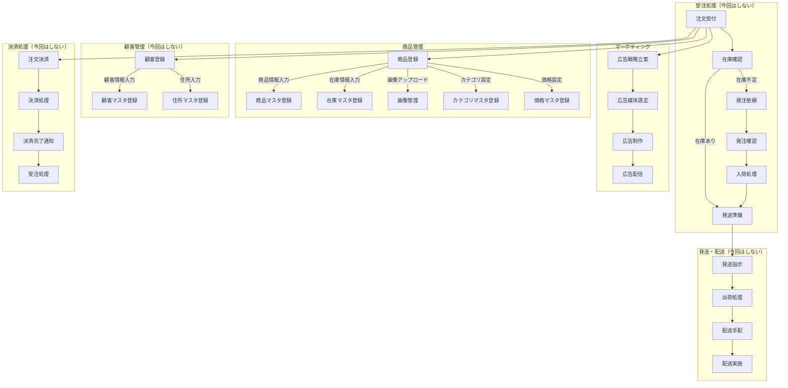
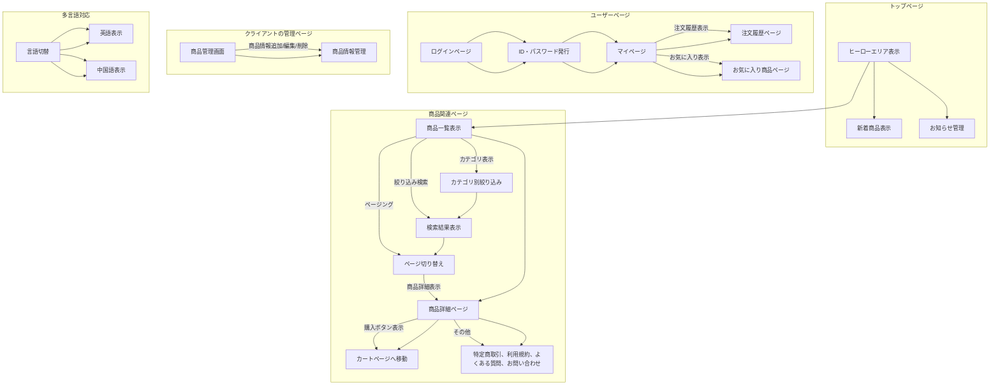

````mermaid
graph TD;

 "トップページ"
  A[ヒーローエリア表示] --> B[新着商品表示]
  A --> C[お知らせ管理]
end

subgraph "商品関連ページ"
  D[商品一覧表示] --> |カテゴリ表示| E[カテゴリ別絞り込み]
  D --> |絞り込み検索| F[検索結果表示]
  D --> |ページング| G[ページ切り替え]
  E --> F
  F --> G
  G --> |商品詳細表示| H[商品詳細ページ]
  H --> |購入ボタン表示| I[カートページへ移動]
  H --> |その他| J[特定商取引、利用規約、よくある質問、お問い合わせ]
end

subgraph "ユーザーページ"
  K[ログインページ] --> L[ID・パスワード発行]
  L --> M[マイページ]
  M --> |注文履歴表示| N[注文履歴ページ]
  M --> |お気に入り表示| O[お気に入り商品ページ]
end

subgraph "クライアントの管理ページ"
  P[商品管理画面] --> |商品情報追加/編集/削除| Q[商品情報管理]
end

subgraph "多言語対応"
  R[言語切替] --> S[英語表示]
  R --> T[中国語表示]
end

A --> D
D --> H
H --> I
H --> J
K --> L
L --> M
M --> N
M --> O
P --> Q
R --> S
R --> T
```
